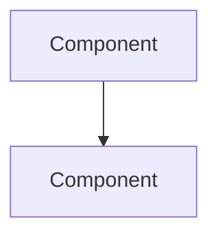

# 🏗️ {{title}}

> **Module:** `[[]]`
> **Status:** 🔴 Not Started / 🟡 In Progress / 🟢 Completed
> **GitHub:** [repo-link]()
> **Started:** {{date:YYYY-MM-DD}}
> **Completed:** 

---

## 📋 Requirements Checklist
- [ ] 
- [ ] 
- [ ] 

## 🏛️ Architecture

### System Diagram

### Key Design Decisions
| Decision | Options Considered | Chosen | Why |
|----------|-------------------|--------|-----|
|          |                   |        |     |

## 📝 Implementation Log

### Day 1 — {{date:YYYY-MM-DD}}
- What I did:
- Blockers:
- Next steps:

## 🐛 Bugs & Issues
| Issue | Status | Solution |
|-------|--------|----------|
|       | 🔴 Open / 🟢 Fixed |  |

## 📊 Results & Metrics
| Metric | Value |
|--------|-------|
|        |       |

## 🎥 Demo
- Demo video: 
- Screenshots:

## 📚 What I Learned From This Project
1. 
2. 
3. 
