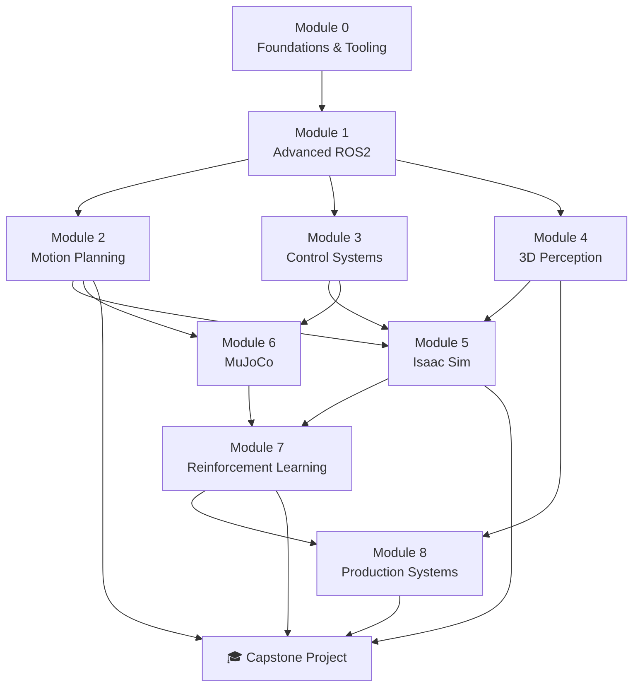

# 🤖 Robotics Software Engineer — Industry-Ready Curriculum

> **Goal:** Transform your existing ROS2/SLAM/CV/DL foundation into a job-ready robotics software engineer skill set that matches 2025–2026 industry demands.

---

## 📋 Curriculum Overview

| # | Module | Duration | Key Skills |
|---|--------|----------|------------|
| 0 | [Foundations & Tooling](modules/module_00_foundations.md) | 1–2 weeks | Linux, C++17, CMake, Git, Docker, CI/CD |
| 1 | [Intermediate & Advanced ROS2](modules/module_01_ros2_advanced.md) | 3–4 weeks | Lifecycle nodes, actions, DDS/QoS, Nav2, composable nodes, ROS2 Control |
| 2 | [Motion Planning & Manipulation](modules/module_02_motion_planning.md) | 3–4 weeks | MoveIt2, FK/IK, OMPL, trajectory optimization, grasping |
| 3 | [Control Systems for Robotics](modules/module_03_control_systems.md) | 2–3 weeks | PID, MPC, state estimation, sensor fusion, Kalman filters |
| 4 | [3D Perception & Sensor Fusion](modules/module_04_perception.md) | 3–4 weeks | Point clouds, PCL, depth estimation, 3D object detection, calibration, SLAM++ |
| 5 | [Simulators — NVIDIA Isaac Sim](modules/module_05_isaac_sim.md) | 3–4 weeks | Omniverse, OmniGraph, synthetic data, digital twins, Isaac ROS |
| 6 | [Simulators — MuJoCo & Physics Engines](modules/module_06_mujoco.md) | 2–3 weeks | MJCF, MuJoCo Playground, contact dynamics, benchmarking |
| 7 | [Reinforcement Learning for Robotics](modules/module_07_reinforcement_learning.md) | 3–4 weeks | PPO, SAC, sim-to-real, domain randomization, curriculum learning |
| 8 | [Production Robotics & Systems Engineering](modules/module_08_production_systems.md) | 2–3 weeks | Behavior trees, safety, fleet management, deployment, interviews |
| 🎓 | [Capstone Project](modules/module_09_capstone.md) | 4–6 weeks | End-to-end autonomous manipulation system |

**Total estimated duration: 26–37 weeks (~6–9 months)**

---

## 🗺️ Learning Pathway



> **Note:** Modules 2, 3, and 4 can be studied in parallel after completing Module 1.

---

## 🎯 What the Industry Demands (2025–2026)

Based on analysis of 100+ job postings at companies like NVIDIA, Boston Dynamics, Agility Robotics, Tesla, Amazon Robotics, Waymo, and startups:

### Must-Have Skills
- **ROS2** (Humble/Jazzy) — lifecycle nodes, custom interfaces, QoS, Nav2, ros2_control
- **C++ (17/20)** and **Python** — performance-critical + rapid prototyping
- **Motion Planning** — MoveIt2, OMPL, trajectory optimization
- **Perception** — 3D point clouds, sensor fusion, camera-LiDAR calibration
- **Simulation** — Gazebo → Isaac Sim / MuJoCo (the industry is shifting)
- **Linux systems** — Docker, systemd, embedded Linux, cross-compilation

### High-Demand Differentiators
- **Sim-to-Real Transfer** — domain randomization, system identification
- **Reinforcement Learning** — PPO/SAC for manipulation and locomotion
- **MPC / Advanced Control** — model predictive control, whole-body control
- **Behavior Trees** — BehaviorTree.CPP, task-level decision making
- **CI/CD for Robotics** — testing in simulation, automated deployment

### Emerging & Frontier
- **Foundation Models for Robotics** — RT-2, Octo, vision-language-action models
- **Digital Twins** — NVIDIA Omniverse, OpenUSD workflows
- **GPU-Native Perception** — Isaac ROS, TensorRT, CUDA optimization
- **Multi-Robot Systems** — fleet coordination, decentralized planning

---

## 🔧 Your Current Strengths (Leverage These!)

| What You Have | How It Maps |
|---|---|
| ROS2 basics | → Fast-track Module 1 (focus on advanced topics) |
| SLAM on Gazebo | → Module 4 builds on this, Module 5 upgrades to Isaac Sim |
| Computer Vision projects | → Module 4 (3D perception) + Module 7 (vision-based RL) |
| Deep Learning projects | → Module 7 (RL) + Capstone (learned manipulation) |
| ESP32 / ESP32-CAM / RPi 4 | → Optional hardware extensions in Modules 1, 3, 4, 8 |

---

## 🖥️ Hardware Usage Policy

> **All modules are designed to be completed 100% in simulation.**
> Hardware (ESP32, ESP32-CAM, RPi 4) is offered as **optional enrichment** in select modules, marked with a 🔌 icon.

| Hardware | Optional Use Cases |
|---|---|
| **RPi 4** | Run ROS2 nodes, deploy lightweight Nav2 stack, edge inference |
| **ESP32** | micro-ROS agent, sensor node, motor control via serial |
| **ESP32-CAM** | Edge vision node, stream to ROS2 for perception pipeline |

---

## 📚 How to Use This Curriculum

1. **Each module markdown** contains: learning objectives, submodules with topics, recommended resources, exercises, and a module project.
2. **Use AI tools** (Gemini, Sonnet, etc.) to dive deeper into any submodule — each one is self-contained enough to serve as a prompt.
3. **Projects are cumulative** — later module projects build on earlier ones.
4. **The capstone** integrates everything into a single portfolio-grade project.

### Suggested Workflow Per Submodule
```
1. Read the submodule overview in this curriculum
2. Ask an AI tool: "Explain [topic] in depth with code examples for ROS2"
3. Follow recommended tutorials / documentation
4. Complete the exercises
5. Build the module project
6. Document everything on GitHub
```

---

## 📁 File Index

| File | Description |
|---|---|
| [Module 0 — Foundations](modules/module_00_foundations.md) | Linux, C++, CMake, Docker, Git |
| [Module 1 — Advanced ROS2](modules/module_01_ros2_advanced.md) | The backbone of your career |
| [Module 2 — Motion Planning](modules/module_02_motion_planning.md) | MoveIt2, arms, planning algorithms |
| [Module 3 — Control Systems](modules/module_03_control_systems.md) | PID → MPC, sensor fusion |
| [Module 4 — 3D Perception](modules/module_04_perception.md) | Point clouds, detection, SLAM |
| [Module 5 — Isaac Sim](modules/module_05_isaac_sim.md) | NVIDIA's flagship simulator |
| [Module 6 — MuJoCo](modules/module_06_mujoco.md) | Physics engine for RL |
| [Module 7 — Reinforcement Learning](modules/module_07_reinforcement_learning.md) | Sim-to-real, PPO, SAC |
| [Module 8 — Production Systems](modules/module_08_production_systems.md) | Ship robots, ace interviews |
| [Module 9 — Capstone](modules/module_09_capstone.md) | Your portfolio centerpiece |

---


